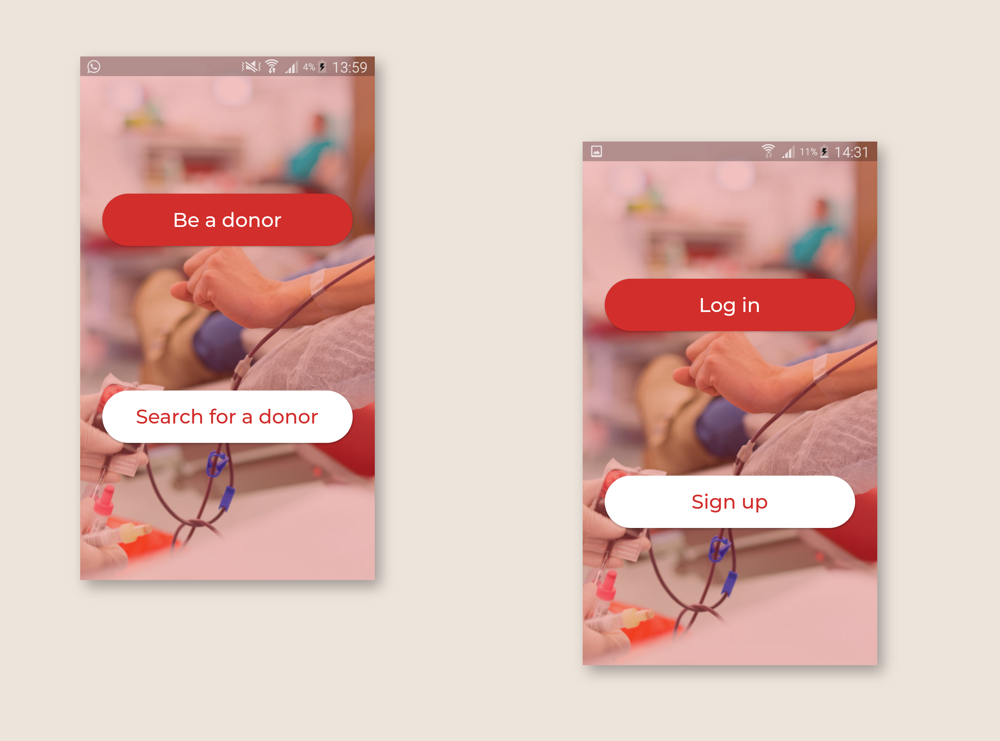
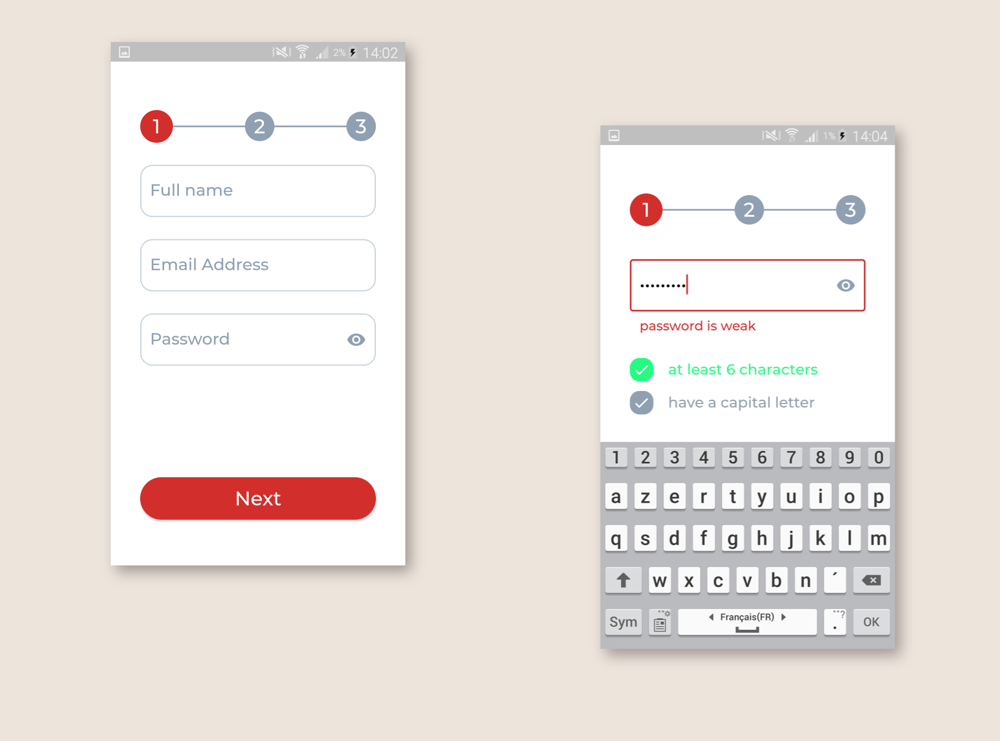
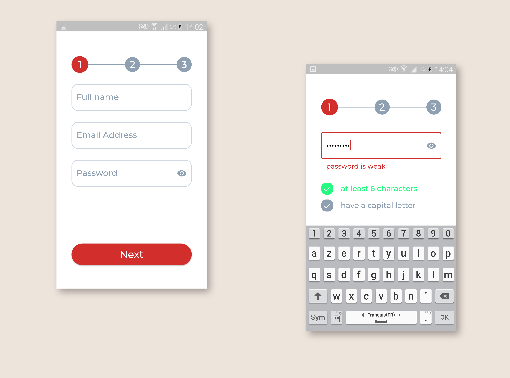
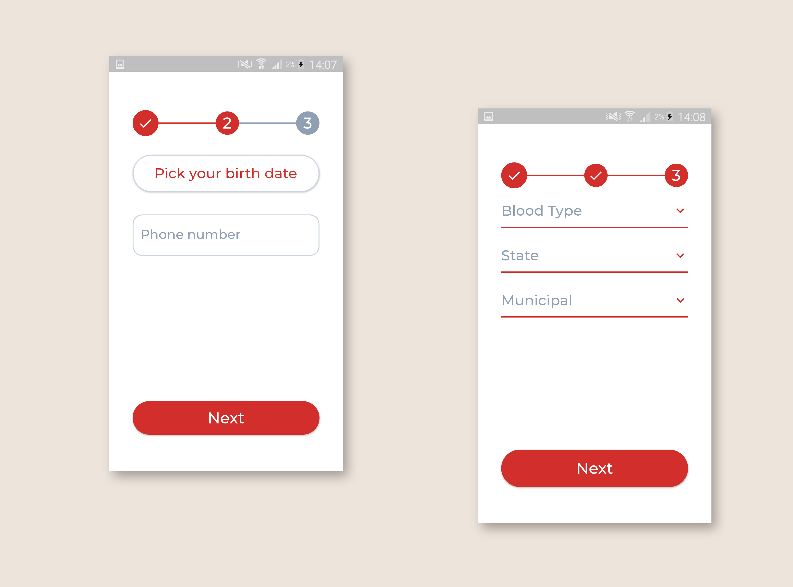
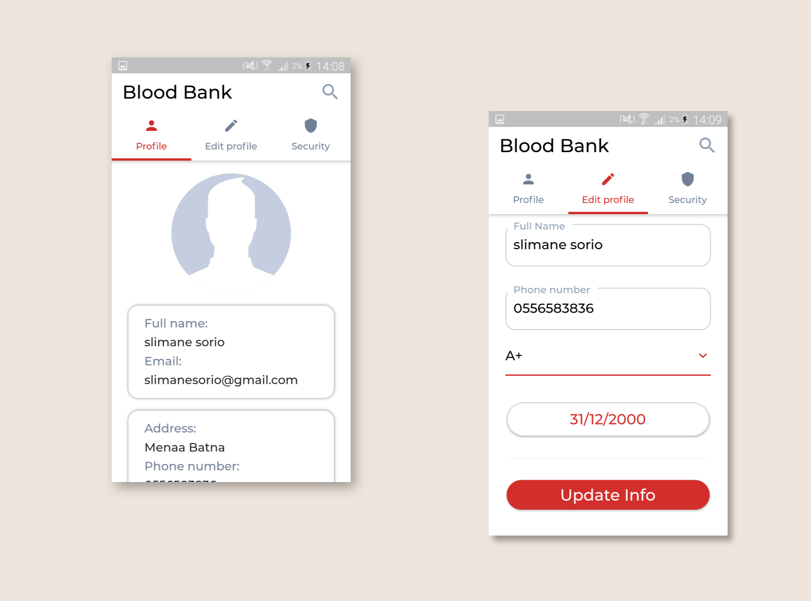
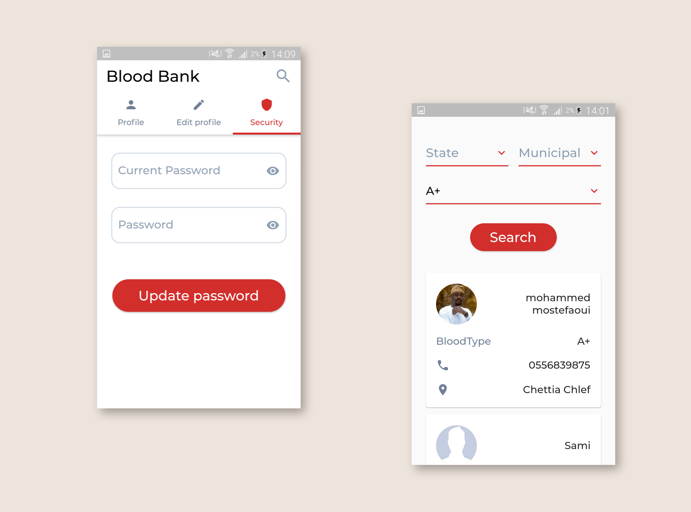

# Blood Bank

A flutter application which can blood donors register themselves in and people who are
in need of blood can find them

In This project, I have practiced on Rest API, UI, and form validation.

## Screenshots

  

  

  

  

  

  

  

  

  

  

  

